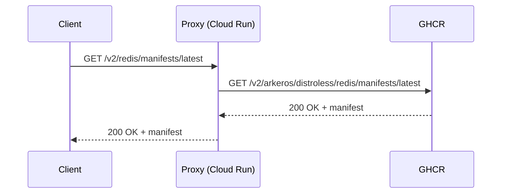
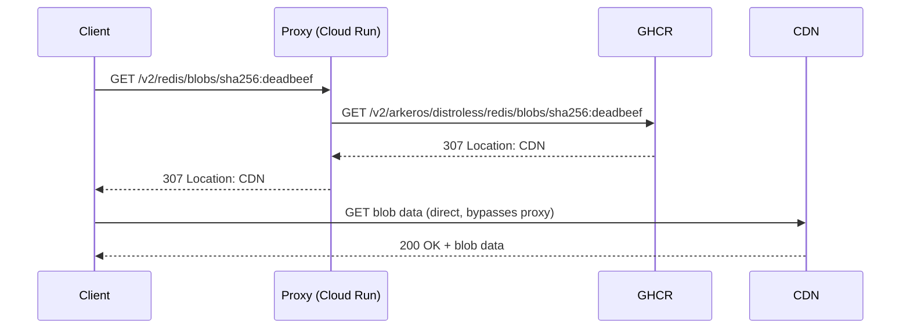

# registry

Pull-only OCI registry proxy that serves images from GHCR under a custom domain.

This is similar in spirit to [archeio](https://github.com/kubernetes/registry.k8s.io/blob/main/cmd/archeio/README.md),
the proxy behind `registry.k8s.io`, but much simpler since we only need to front a single upstream registry.

## Why

**Vanity domain.** Publishing container images to `ghcr.io/arkeros/distroless/redis` ties image references to a
specific hosting provider. A custom domain like `distroless.io/redis` decouples the public-facing image name
from the backend, so we can migrate to a different registry (GAR, ECR, self-hosted, etc.) without breaking
existing references.

**Minimal cost.** The proxy only handles metadata requests (manifests, tags). Blob requests — which make up
the vast majority of bandwidth — are redirected to the upstream registry, so the proxy never transfers
image layer data. This keeps Cloud Run costs near zero since blob traffic flows directly between the client
and GHCR.

## How it works

Manifests and tags are proxied (small metadata):



Blobs are redirected (large layer data never flows through the proxy).
GHCR redirects to `pkg-containers.githubusercontent.com`:



The proxy:
1. Receives OCI Distribution API requests at `/v2/<name>/...`
2. Rewrites paths by prepending the repository prefix: `/v2/arkeros/distroless/<name>/...`
3. Handles upstream auth transparently via the standard OCI token challenge flow
   (using [go-containerregistry](https://github.com/google/go-containerregistry)'s transport)
4. Passes through redirect responses for blobs — the proxy never serves blob data itself,
   clients are redirected to the upstream's storage backend (CDN) directly

## Usage

```sh
registry --upstream=ghcr.io --repository-prefix=arkeros/distroless --port=8080
```

## Supported endpoints

- `GET /v2/` — API version check
- `GET /v2/<name>/manifests/<reference>` — pull manifests
- `GET /v2/<name>/blobs/<digest>` — pull blobs (including redirect passthrough)
- `GET /v2/<name>/tags/list` — list tags
- `GET /v2/<name>/referrers/<digest>` — list OCI 1.1 referrers (signatures, SBOMs, attestations)

Push is not supported; images are pushed directly to GHCR via CI.

## Deployment

Deployed to Cloud Run in the regions listed in [`regions.json`](./regions.json) by the `push-gar` and `deploy` jobs in [`.github/workflows/ci.yaml`](../../../.github/workflows/ci.yaml). Each region is a separate service, all applied from the one Knative manifest at [`service.yaml`](./service.yaml) via `gcloud run services replace --region=<region>`, and all sharing one runtime GSA. Cloud Run service names are region-scoped, so `registry` in every region does not collide.

`push-gar` pushes the image and resolves its digest once, then publishes that digest and the region list as job outputs; `deploy` fans out over them with nothing but `gcloud`. Adding or removing a region is an edit to `regions.json` alone — the workflow matrix is generated from it.

Region fan-out is for latency, not identity — the services are replicas of the same workload, so they share one service account (one row in audit logs and IAM bindings, not three). Fronting them behind a single anycast IP is the job of the external HTTPS load balancer.

The manifest is the desired state and carries no image: the deploy job substitutes `IMAGE_PLACEHOLDER` with the digest it just pushed. Regions deploy sequentially (`max-parallel: 1`), so a bad image stops at the first one.

Only the revision ships from CI. [`//infra`](../../../infra) owns everything durable — the Artifact Registry repo, the `svc-registry` runtime GSA, and the `allUsers` `run.invoker` bindings — and is applied out of band, because none of it changes when a new revision does. Those bindings can't live in the manifest anyway: IAM on a Cloud Run service is a policy, not part of its Knative spec. Terraform reads the same `regions.json` the deploy matrix does, so a new region gets its binding without a second edit.

Image pull path is the shared multi-region `europe` GAR provisioned by `//infra`. All three Cloud Run regions pull from the same `europe-docker.pkg.dev/senku-prod/containers/registry@<digest>` URL.

The image is pushed to **two** destinations: **GHCR** for the public `distroless.io` mirror, and **GAR** for Cloud Run's deploy-time pull (Cloud Run can't pull from GHCR directly). Separate Bazel targets for each — `:image_push` and `:image_push_gar`.

To deploy by hand — normally CI's job, but useful for a one-off region or a rollback:

```sh
bazel run //oci/cmd/registry:image_push_gar

# The digest comes from the build, not from a tag lookup — same bytes as the
# push, by construction.
bazel build --remote_download_outputs=all \
    //oci/cmd/registry:image --output_groups=digest
DIGEST=$(cat "$(bazel cquery //oci/cmd/registry:image \
    --output=files --output_groups=digest)")
REPO=europe-docker.pkg.dev/senku-prod/containers/registry

sed "s|IMAGE_PLACEHOLDER|$REPO@$DIGEST|" oci/cmd/registry/service.yaml \
    | gcloud run services replace - --region=europe-west3
```

The GHCR public-mirror push (`:image_push`) is separate so a release can gate the public distribution independently. Debug variants: `:image_debug_push` / `:image_debug_push_gar`.

## Testing

```sh
bazel test //oci/proxy:proxy_test
```

## TODO

- [ ] Add OCI-compliant authentication (token challenge flow on `/v2/`) — the proxy is currently unauthenticated and exposed on the public internet

## See also

- [archeio](https://github.com/kubernetes/registry.k8s.io/blob/main/cmd/archeio/README.md) — Kubernetes' registry.k8s.io proxy, similar architecture
- [OCI Distribution Spec](https://github.com/opencontainers/distribution-spec/blob/main/spec.md) — the spec this proxy implements (pull subset)
